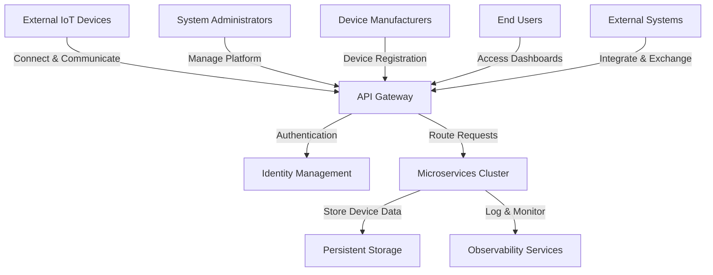

# IoT Platform Software Requirements Specification

## Architectural Overview and Design Philosophy

The proposed IoT platform is designed as a comprehensive, scalable, and secure ecosystem for managing Internet of Things (IoT) devices across various domains. The architecture emphasizes modularity, extensibility, and robust performance, utilizing a microservices-based approach that allows for independent scaling and development of individual components. By leveraging .NET 9 and adopting cloud-native principles, the platform will provide a flexible solution that can adapt to evolving technological landscapes and diverse IoT deployment scenarios.

## Core Architectural Principles

The platform's architecture is founded on several key principles that guide its design and implementation. Foremost is the commitment to a clean, layered architecture that separates concerns and promotes loose coupling between system components. This approach enables easier maintenance, testing, and future enhancements. The microservices architecture allows each service to be developed, deployed, and scaled independently, providing granular control over system resources and performance. Additionally, the design prioritizes security at every layer, implementing robust authentication, authorization, and data protection mechanisms.

## Service-Oriented Design

Each microservice within the platform is designed to be self-contained and responsible for a specific domain of functionality. This approach allows for independent development teams, enables technology-agnostic service implementations, and facilitates easier replacement or upgrade of individual components. The services communicate through well-defined interfaces, primarily using asynchronous messaging patterns and event-driven architectures. This design ensures high availability, resilience, and the ability to handle complex, distributed system requirements.

## Data Management and Persistence Strategy

The platform adopts a sophisticated data management approach that balances performance, scalability, and data integrity. By utilizing a combination of relational and NoSQL databases, the system can efficiently handle diverse data types and access patterns typical in IoT environments. Event sourcing and CQRS (Command Query Responsibility Segregation) principles are applied to provide comprehensive audit trails, support complex querying needs, and enable advanced analytics capabilities. The data layer is designed to support multi-tenancy, ensuring secure and isolated data management for different customers or device ecosystems.

## Security and Compliance Framework

Security is a paramount consideration in the platform's architecture. A comprehensive security model is implemented across multiple layers, starting from device registration and extending through authentication, authorization, and data transmission. The platform integrates advanced identity management using Keycloak, providing robust mechanisms for device and user authentication, role-based access control, and fine-grained permission management. Cryptographic techniques such as mutual TLS, certificate-based authentication, and hardware-backed key storage ensure the integrity and confidentiality of device communications.

## Scalability and Performance Optimization

The platform is engineered to support massive device ecosystems with potentially millions of connected devices. Horizontal scalability is achieved through stateless service design, containerization, and support for dynamic resource allocation. Advanced caching strategies, efficient message queuing, and optimized data processing pipelines ensure low-latency performance even under high load. The architecture supports geographically distributed deployments, allowing for edge computing capabilities and localized data processing to reduce network latency and improve overall system responsiveness.

## Context Diagram

